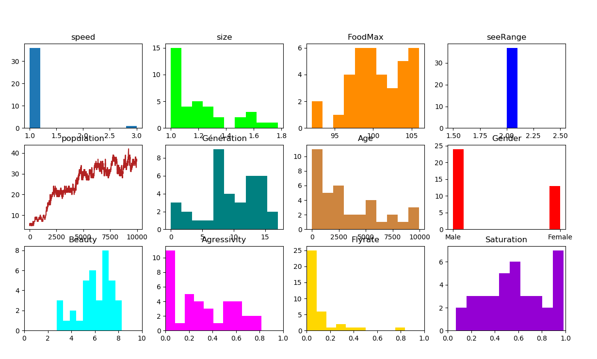
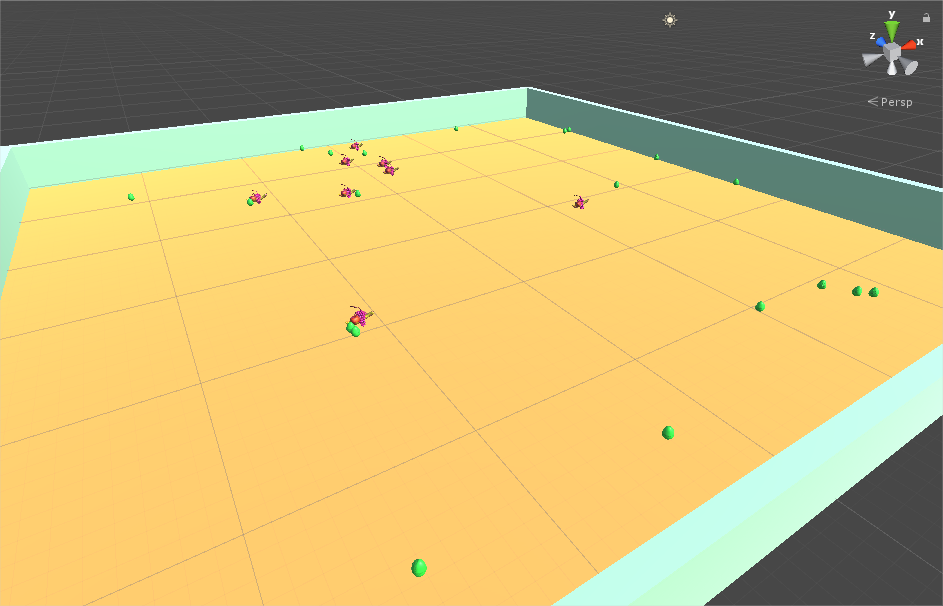
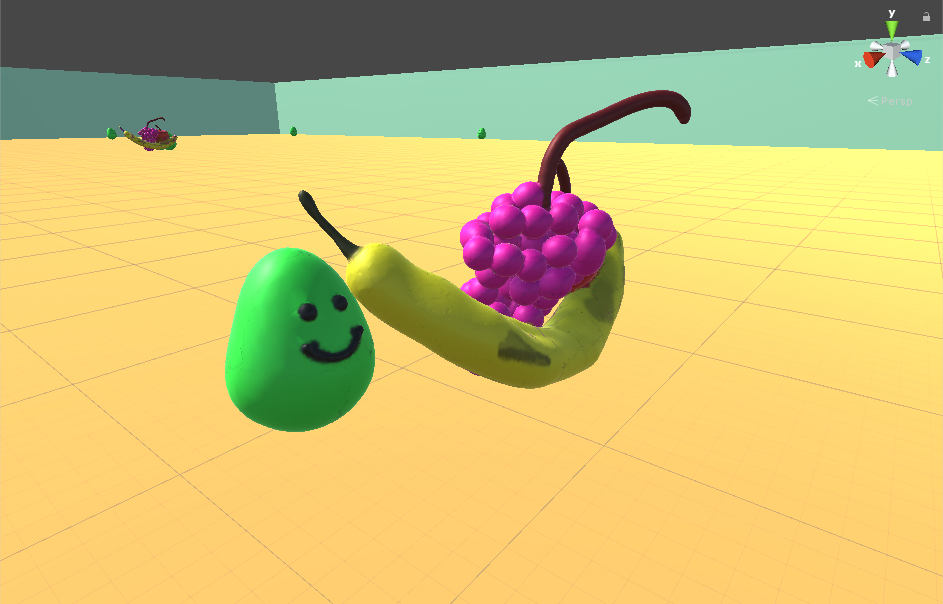

# Slimes (Projet en attente d'idées)
Simulation d'évolution d'une population de slimes

# Introduction
J'ai été inspiré par le travail de Primer [Chîne Youtube Primer](https://www.youtube.com/channel/UCKzJFdi57J53Vr_BkTfN3uQ), qui simule des phénomènes (comme la loi de l'offre et de la demande, l'optimisation de productivité, la croissance d'une population, etc.) à travers la modélisation de créatures évoluant sur un plateau de jeu.

**Problématique :** Est-il possible de simuler l'évolution (au sens Darwinien du terme) d'une population , en reprenant le même cadre (ie. des créatures sur un plateau limité)?

# Principe 
Mettre sur un terrain de jeu des créatures, les "*Slimes*" ainsi que des sources ponctuelles de nourriture. Les *slimes* ont la capacité de se déplacer, de voir la nourriture, de se nourrire quand une source de nourriture est assez proche, de voir leur congénères, de les attaquer ainsi que de se reproduire.

Chaque *slime* a des gènes, déterminant ses caractères, comme sa vitesse, force, taille, beauté, etc. Ces caractères ont bien sûr une incidence sur leur relation au monde. Par exemple leur vitesse leur permet d'accéder à la nourriture plus ou moins vite que les autres, au coût d'une plus ou moins grande dépense d'énergie.

Lors de la reproduction, les créatures mélangent aléatoirement leur génome et le génome résultant est ensuite soumis à des mutations, aléatoires, selon des hyperparamètres fixés.

# Implémentation
J'ai commencé par implémenter cette simulation en Python, donc sans interface graphique complexe. Les slimes jouent tour par tour (cf. plus loin), dans un ordre randomisé à la fin de chaque tour, pour ne pas induire de biais favorable perturbateur. Python oblige, on ne peut pas voir en direct les slimes évoluer, mais j'ai mis en place une interface "statistique". C'est-à-dire que l'on voit en permanence les graphes de répartition des différents caractères dans les génomes des slimes. On peut donc à tout instant se donner une idée de la tendance de l'évolution, ie. quels caractères sont favorisés et lesquels ne le sont pas.

Dans une première version, pour simplifier, le terrain de jeu est une grille discrète, les slimes sont placés dans une matrice. Bien sûr, ceci est très peu réaliste, donc j'ai changé cela pour avoir un terrain de jeu continu dans la deuxième version.

Ensuite, dans une volonté d'améliorer les performances et l'équilibre de la simulation, en permettant à tous les slimes d'agir en même temps, j'ai utilisé le module **Threading** de Python, en assignant chaque *slime* à un thread. Le résultat était cependant assez décevant, avec des performances plus mauvaises qu'avant. J'ai donc abandonné cette idée et j'en suis resté là pour mon implémentation en Python.

Je me suis alors interessé au moteur de jeu **Unity**, qui permet de contrôler, et de visualiser, facilement des objects en 3D (les fichiers *.cs* sont les fichiers en C# que j'ai écrits pour Unity).

Les comportements des slimes sont les mêmes que dans mon implémentation en Python, à ceci près que j'ai plus développé les méchanismes d'attaque/fuite, car je pouvais mieux visualiser leur fonctionnement.

Les modèles 3D des *slimes* et de la nourriture ont été modélisés par mes soins

# Observations
- Certains caractères ont une influence importante sur la survie des créatures, ce qui se voit dans l'évolution rapide de ces  caractères dans la population.

Par exemple, dans un premier temps, la taille des *slimes* n'a fait qu'augmenter, car elle leur permet de plus impressionner les potentiels rivaux + d'avoir de plus grandes réserves de nourriture.

- L'allèle de ces caractères le plus favorisé dépend fortement des **lois physiques** arbitrairement imposées au jeu.

Par exemple, après avoir observé que la taille des slimes ne faisaient qu'augmenter (signe qu'une taille la plus grande possible était très favorable), j'ai ajusté les lois physiques du monde pour que la taille joue un rôle plus pénalisant dans la quantité d'énergie dépensée à chaque tour pour se déplacer (plus précisément, je suis passé d'un modèle où l'énergie consommé par une créature de masse **m** est *linéaire* par rapport à **m** à un modèle où elle est *quadratique* par rapport à **m**)

Dès lors, la taille plafonnait à une certaine valeur, signe que les slimes avaient atteint un équilibre, concernant ce caractère.

# Pistes pour le futur
Ayant travaillé sur les réseaux de neurones, je souhaiterais équiper les *slimes* de réseaux de neurones (*a priori* des réseaux hybrides linéaires/récursifs/convolutifs), qui leur permettent d'agir (donc bouger, se reproduire, attaquer, etc.) de façon plus autonome et "intelligente". Je pense qu'il faudrait déjà implémenter un environnement Python d'apprentissage par renforcement (comme le fait [OpenAI](https://openai.com/blog/emergent-tool-use/)). Ceci représente un projet particulièrement ambitieux, sur lequel je n'ai pas encore eu le temps de me pencher.

